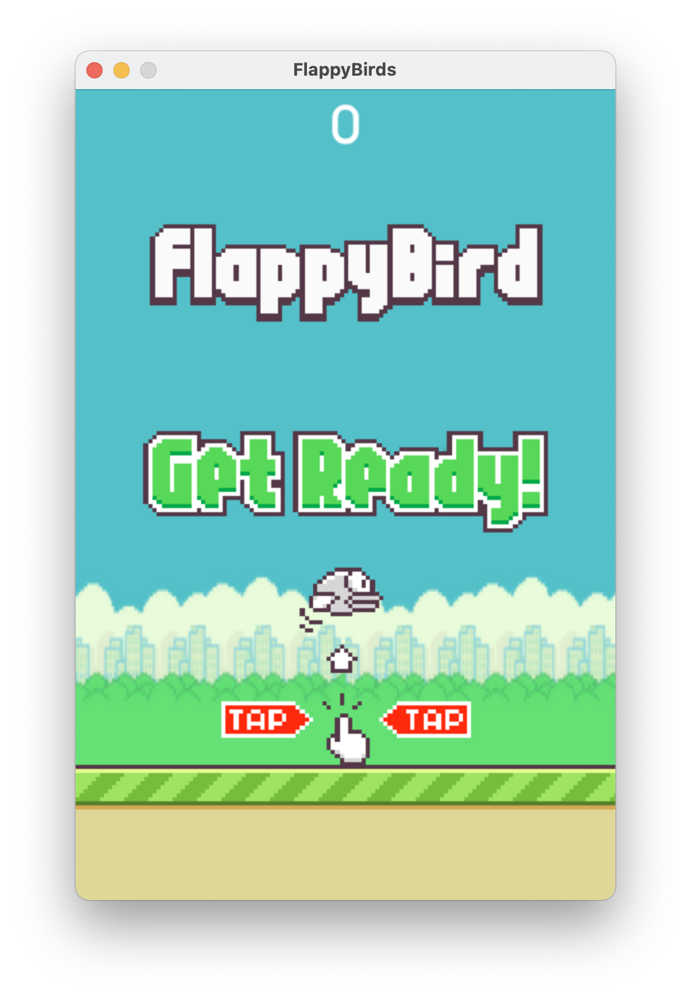

---

## About

We all miss the legendary game Flappy Birds on our cell phones. 

So here is a clone of the famous game written in Python using pygame.



Just start the game with ````python main.py```` and hit ENTER to begin.

---

## Credits

[FlappyBird Assets](https://github.com/samuelcust/flappy-bird-assets)

Main menu sound provided by [CodeManu](https://opengameart.org/users/codemanu)


